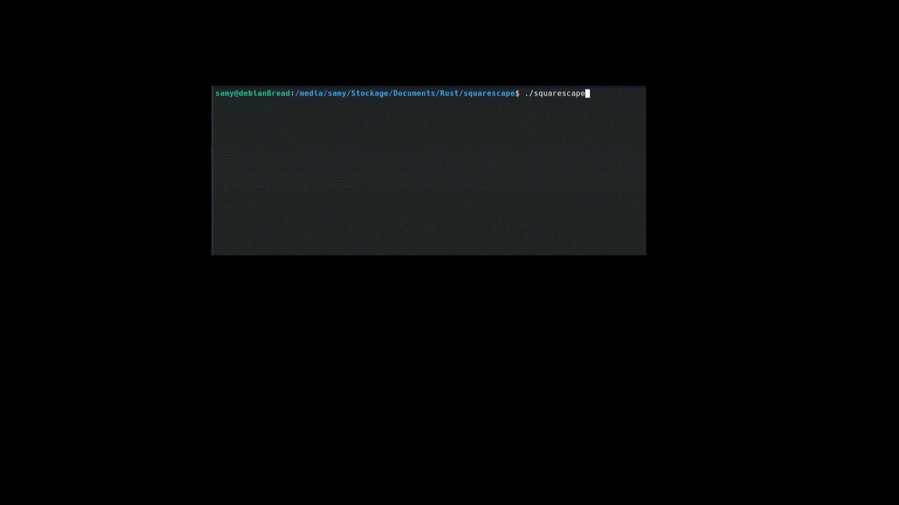

# squarescape

A little terminal game I made to learn Rust 🦀

⚠️ This program only works on GNU/Linux distributions.

## How to play ?

You control the green square 🟩, your goal is to reach the blue square 🟦.

### The squares

- 🟩 You
- 🟦 The exit
- ⬜ A wall
- 🟥 Kills you if you touch it

### Controls

- Move with the arrow keys
- Press "r" to restart
- Press "q" to exit the program

### Preview



## Installation

- Clone this repository
```
git clone https://github.com/Smahe01/squarescape.git
```

- Install Rust: [https://www.rust-lang.org/tools/install](https://www.rust-lang.org/tools/install)

- Compile with cargo
```
cd squarescape
cargo build --release
```

- Move the executable (important because levels are indicated by a relative path).
```
mv target/release/squarescape .
```

- You can now enjoy the game !
```
./squarescape
```
